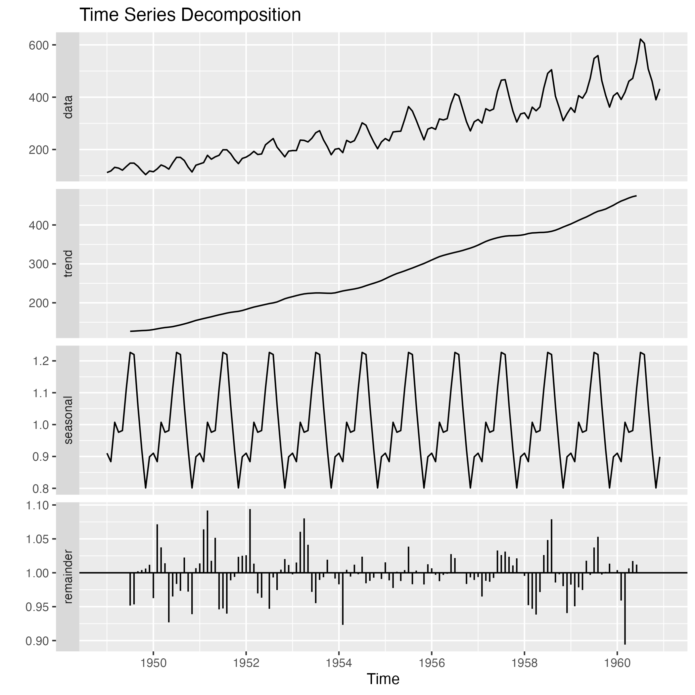

# Time Series Analysis on AirPassengers Dataset

This project showcases a time series analysis on the classic `AirPassengers` dataset, which represents the monthly totals of international airline passengers from 1949 to 1960.

## Objective:
To decompose the time series into its primary components (trend, seasonal, and residual) and forecast future airline passenger numbers using the SARIMA model.

## Dataset:
- **Name**: AirPassengers
- **Description**: Monthly totals of international airline passengers from 1949 to 1960.
- **Source**: Box, G. E. P., Jenkins, G. M. and Reinsel, G. C. (1976) Time Series Analysis, Forecasting and Control. Third Edition. Holden-Day. Series G.

## Project Structure:

- `/data`: Contains the dataset in CSV format.
- `/scripts`: Contains R scripts used for analysis.
  - `01_data_preparation.R`: Loads and preprocesses the dataset.
  - `02_time_series_decomposition.R`: Decomposes the time series into its components.
  - `03_sarima_model.R`: Fits a SARIMA model and forecasts future values.
- `/output`: Contains generated plots and outputs.

## How to Run:

1. Clone the repository to your local machine.
2. Set your working directory in R to the project's root folder.
3. Execute the scripts in the `/scripts` directory in sequence:
   - `01_data_preparation.R`
   - `02_time_series_decomposition.R`
   - `03_sarima_model.R`
4. Check the `/output` directory for generated plots.

## Results:

The time series was successfully decomposed to showcase the underlying trend, seasonal fluctuations, and residuals. A SARIMA model was fitted to forecast future passenger numbers.

### Decomposed Time Series:

### SARIMA Forecast:

